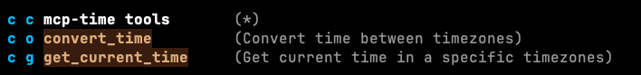
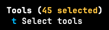

# Configuration

Note the following setup is highly changeable as tools in the space are evolving at very fast pace.

The prerequisite is to follow the [Setting up the project](https://github.com/bhauman/clojure-mcp/tree/main?tab=readme-ov-file#setting-up-the-project) and make sure the REPL and the `clojure-mcp` server can both be launched at the terminal.

Afterwards, you can continue configuring the other two moving parts on the emacs side:

* [mcp.el](https://github.com/lizqwerscott/mcp.el): Emacs client for interfacing with MCP, supporting connections to MCP servers.
* [gptel](https://github.com/karthink/gptel): A simple LLM client for Emacs

## MCP server setup

```elisp
(setq mcp-hub-servers
      '(("clj-prj" . (:command "/bin/sh"
                      :args ("-c"
                             (concat "cd /path/to/your/clojure/project && "
                                     "PATH=/your/bin-or-nix/path:$PATH && "
                                     "clojure -X:mcp :port 7888"))))))
```

With the above configuration, the mcp server will connect to a running REPL server on the port 7888 - don't forget to start it first.

After eval-ing the form you should be able to `M-x mcp-hub` and start/stop `clj-prj`.

> [!TIP]
> mcp.el creates a `*clj-prj events*` buffer that can help debugging issues.

## Gptel 

The `mcp.el` integration was added very recently and needs you to explicitly eval:

```elisp
(require 'gptel-integrations)
```

[Gptel's own documentation](https://github.com/karthink/gptel/?tab=readme-ov-file#model-context-protocol-mcp-integration) perfectly describes how to add tools to your next request so we will delegate to it.

Note that `gptel` can not only add but also start the MCP server for the tools you add via `M+`. 

If everything went well you must see:

tools listed in `M-x gptel-tools` | a number in `M-x gptel-menu`
:--------------------------------:|:-----------------------------:
  |  

### FAQ

* Why does the LLM responds with "uses clojure_edit_replace_definition to rename ..."?

  This can usually mean tools are not enabled/added in `gptel` - no matter their `mcb-hub` status.

